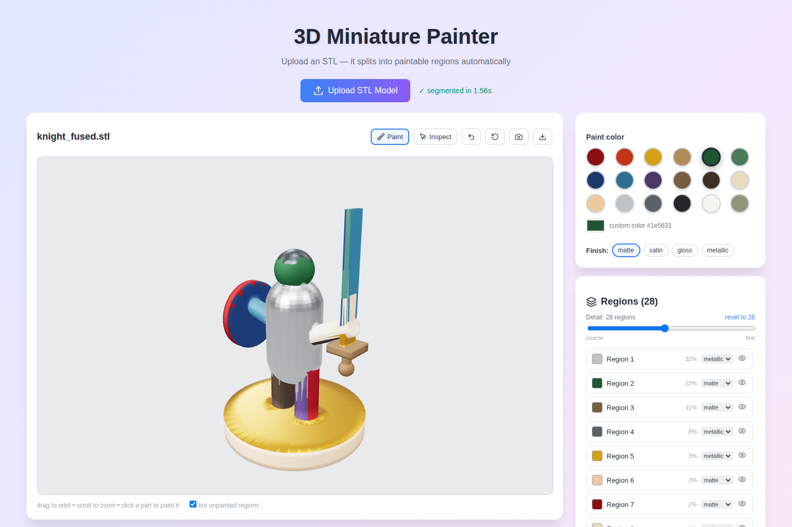

# 3D Miniature Painter

Upload a miniature STL and it is **automatically split into paintable
regions** — armor vs. cloak vs. sword vs. base — which you can then recolor
independently, like layers in an image editor, to preview paint schemes
before committing brush to plastic.



## How it works

The old idea of running SAM over rendered views and projecting masks back
onto the mesh was abandoned: STL miniatures have no texture, so part
boundaries are *geometric* features. The backend segments the mesh directly:

1. **Over-segmentation** — the mesh is split into ~500 small surface patches
   by crease-aware region growing (multi-source Dijkstra over the face
   adjacency graph, where stepping across a concave crease is expensive —
   the Katz–Tal "angular distance" idea), plus Lloyd relaxation so patch
   borders are compact and snap to sharp edges.
2. **Shape thickness** — a Shape Diameter Function per face (cone of rays
   cast inward, median distance), so a thin sword blade reads as a
   different structure than the thick torso it is welded to.
3. **Hierarchical merging** — adjacent patches merge greedily, cheapest
   boundary first (boundary concavity + thickness difference), and the full
   merge sequence is sent to the client. The **granularity slider replays
   that sequence with a union-find**, so moving between "5 big regions" and
   "60 fine regions" is instant, with no server round trip.
4. Paint (color + matte/satin/gloss/metallic finish) is stored per *base
   patch*, so your scheme survives granularity changes.

Segmenting a 55k-triangle model takes ~1.5 s on CPU. Meshes over 90k faces
are decimated internally for segmentation and labels are mapped back to full
resolution. Multi-part STLs (separate shells) are handled naturally —
connected components can never merge with each other before real parts do.

## Running it

Backend (needs Python 3.10+ installed):

```bash
backend/start_backend.sh           # Windows: backend\start_backend.bat
```

The script creates a venv and installs dependencies on first run, then
serves on http://127.0.0.1:5000. The extras in
`requirements-optional.txt` (fast ray casting for the thickness feature)
are installed best-effort — the backend works without them.

Frontend:

```bash
npm install
npm start                          # opens http://localhost:3000
```

Or both at once (Mac/Linux): `./start.sh`

## Using it

- **Upload** a binary or ASCII STL. The model appears immediately;
  segmentation lands a second or two later (unpainted regions get muted
  distinct tints — toggle "tint unpainted regions" off for plain gray).
- **Paint mode** (default): pick a color and a finish, then click a part.
- **Inspect mode**: click selects the region without painting.
- **Detail slider**: coarser = regions merge (in geometry-aware order),
  finer = they split. Paint sticks to the fine patches underneath.
- Layer list: double-click to rename, eye icon to hide/show a region,
  per-region finish dropdown.
- **Ctrl+Z** undoes paints. Camera button saves a PNG; download button
  exports the paint scheme as JSON.

## Verifying the segmentation

`backend/make_test_mini.py` builds two synthetic knights (one fused into a
single watertight surface — the hard case — and one of loose parts) with
construction-time ground truth, and `backend/tests/test_segmentation.py`
scores the segmentation against them (region purity / recall /
fragmentation per semantic part) and checks that STL triangle order is
preserved through the load path, which the client depends on:

```bash
cd backend
venv/bin/python make_test_mini.py      # regenerate fixtures (needs manifold3d)
venv/bin/python tests/test_segmentation.py
```

## Repo layout

```
backend/
  app.py            Flask API (POST /api/segment)
  segmenter.py      the segmentation pipeline
  make_test_mini.py test fixture generator
  tests/            verification harness + fixtures
src/
  components/       ThreeScene (rendering/picking), LayerPanel, pickers
  utils/            STL parsing, segmentation client, union-find replay
```

## Known limitations

- STL only for now (OBJ/3MF/GLB would need matching order-preserving
  parsers on both sides).
- Region boundaries on large smooth featureless areas are arbitrary — there
  is no crease to snap to. Painting adjacent regions the same color hides
  this entirely.
- No per-face brush yet: the finest paintable unit is a base patch
  (~0.2 % of the surface).
- 2D image mode (photo → layers) is not implemented; the 3D path was the
  goal here.
